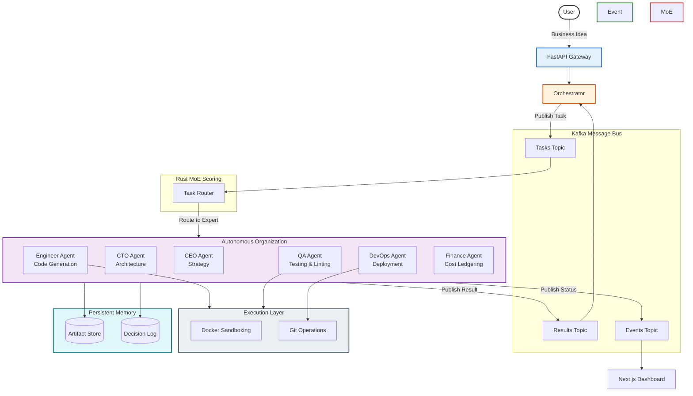

# Autonomous Multi-Agent AI Organization

> A production-grade, event-driven, AWS/Kubernetes deployable system where AI agents autonomously build and deploy real software from a single business idea.

---

## Overview

Build autonomous, reliable, multi-agent workflows without hardcoding linear steps. Define your goal through a business idea, and the framework utilizes a high-performance Mixture-of-Experts (MoE) engine to route sub-tasks, while specialized agents communicate asynchronously over a dedicated Kafka event bus.

This framework is explicitly designed to handle complex business requirements, continuous task graphs, and deterministic multi-agent collaboration while providing military-grade sandboxing and real-time observability.

### The Advantage

| Traditional Frameworks     | This Organization                      |
| -------------------------- | -------------------------------------- |
| Hardcode agent workflows   | Event-driven Kafka message bus         |
| Synchronous execution      | Asynchronous, parallel agent execution |
| Static tool configurations | Dynamic Docker workspace sandboxing    |
| Simple LLM calling         | High-Performance Rust MoE routing      |
| Reactive error handling    | Proactive metrics and telemetry        |
| Opaque processing          | Next.js Real-Time Dashboard            |

## Architecture



## Core Subsystems

### 1. The Orchestrator

The `orchestrator/` module is the beating heart of the autonomous loop. It compiles unstructured business requirements into a Directed Acyclic Graph (DAG) of actionable tasks using `task_graph.py`. Rather than calling agents directly, it dispatch payloads securely onto a distributed Kafka topic via `kafka_dispatcher.py`.

### 2. High-Performance MoE Routing (Rust)

The `moe-scoring/` module is written in Rust to guarantee sub-millisecond task evaluation and dynamic expert routing. When tasks flood the Kafka pipeline, the MoE Engine evaluates agent specializations concurrently and pairs complex tasks (e.g., "Write database schema") with the most highly weighted expert (`CTO Agent`).

### 3. Agent Execution Engine

Contained within `agents/`, we utilize a highly customized integration with Google Gemini 2.5 Flash. Each agent possesses explicit context boundaries:

- **CEO Agent**: Focuses strictly on market research, project definition, and aligning business requirements.
- **CTO Agent**: Takes CEO requirements and enforces technical structure, system design, and database schema mappings.
- **Engineer Agent**: Executes technical implementations precisely using standard Git/Docker workflows via isolated execution context.
- **QA Agent**: Uses Pytest and static analyzers (e.g., Flake8, Bandit) to harden the software independently of the Engineer.
- **DevOps Agent**: Produces containerization strategies and generates infrastructure-as-code (Terraform/Kubernetes/Helm).
- **Finance Agent**: Observes prompt usage and dynamically calculates execution costs maintaining strict limits against cloud budgets.

### 4. Real-time Dashboard

The Next.js-based `dashboard/` integrates `useWebSocket.ts` to consume the Kafka `ai-org-events-*` topics in real-time. It renders:

- **Task DAG Viewer**: A visual, interactive node map tracking dependency graph resolution.
- **Live Agent Feed**: A scrolling timeline monitoring internal agent sub-thoughts and code generation.
- **Cost Meter**: Displaying API utilization scaling from $0 to absolute limits per run.
- **System Metrics**: Visual representation of active processing vectors.

### 5. Application Observability

Operational monitoring exists in `observability/`, ensuring production reliability through Prometheus metrics extraction and structured JSON tracing. Metrics are strictly gathered regarding task duration overheads, agent model latency, and token consumptions.

### 6. Memory and Persistence

The `memory/` component maintains critical multi-turn contexts so agents understand continuity:

- **Decision Log**: Captures an immutable thread of architectural decisions made by the CTO and CEO.
- **Artifacts Store**: Persists output implementations (source code files, design documents, environment stubs).
- **Cost Ledger**: Centralized tracking preventing runaway loops.

## Quick Start

### Prerequisites

- Python 3.11+
- [Docker](https://docs.docker.com/get-docker/) and Docker Compose
- Node.js 20+ (for the dashboard)
- Git
- Rust/Cargo (for building the MoE engine natively, if running outside Docker)

> **Note for Windows Users:** It is strongly recommended to use **WSL (Windows Subsystem for Linux)** or **Git Bash** to run this framework. Some core execution tools and sandboxing environments rely on Linux-native directory contexts.

### Installation

```bash
# Clone the repository
git clone https://github.com/DsThakurRawat/Autonomous-Multi-Agent-AI-Organization.git
cd "Autonomous Multi-Agent AI Organization"

# Set up the Python environment (Linux / macOS / Windows WSL)
python3 -m venv venv
source venv/bin/activate

# Install core dependencies
pip install -r requirements.txt

# Compile the Rust MoE Engine module natively
cd moe-scoring
cargo build --release
cd ..

# Install Dashboard dependencies
cd dashboard
npm install
cd ..

# Configure Environment Variables
cp .env.example .env
```

Open `.env` and configure your API keys and Kafka bindings.

```dotenv
# .env layout
# Required Core
GEMINI_API_KEY=AIzaSy...
KAFKA_BROKERS=localhost:9092
KAFKA_USE=true

# Observability
LOG_LEVEL=INFO
PROMETHEUS_PORT=8000
```

### Running the System

Start the infrastructure and services via Docker Compose, which automatically builds the required Sandbox layers, spins up Zookeeper/Kafka, and launches the API.

```bash
docker-compose up --build
```

Access the real-time observability dashboard by navigating to: `http://localhost:3000`

## Security & Sandboxing

- **Execution Sandboxes:** Agents executing code generation tasks run commands blindly relying on isolated Docker containers to prevent unauthorized directory traversal or catastrophic host damage.
- **API Key Management:** Keys are injected dynamically at runtime via secure environment configurations. No keys are persisted to local storage artifacts by the agents.
- **Least Privilege Access:** AI agents receive strictly limited toolsets appropriate for their bounded scope. The CEO cannot write Python; the Engineer cannot manipulate billing architectures.

## Deployment Ecosystem

The Autonomous Organization can be lifted directly into production using the native `infra/` definitions.

### Kubernetes Helm Charts

Deploy into Managed Kubernetes (EKS, GKE) quickly using Helm.

```bash
cd infra/helm/ai-org
helm install ai-org . --namespace ai-org-system --create-namespace
```

### Terraform AWS Deployments

Construct the required compute environments (ECS Fargate clusters, RDS backing layers, API Route53 Gateways) natively.

```bash
cd infra/terraform
terraform init
terraform plan
terraform apply
```

## Enterprise Features Integrated

Based on deep architectural analyses of leading open-source frameworks, the following production-ready features are fully integrated into this organization:

1. **State Memory & Agent Rewinding**: Utilizing a shadow Git branch tracker (`ai-org/checkpoints/v1`), the Orchestrator instantly check-points the workspace and internal AI memory after every task completion. If an agent loops, the system allows for an instant rollback via the WebSockets gateway.
2. **Adaptive Goal-Driven Graph Generation**: Pre-computed linear tasks are deprecated. The Orhestrator dynamically reads the Business idea and utilizes a master Core LLM to generate a customized, zero-cycle DAG graph JSON dynamically matching project requirements.
3. **Omni-Channel Control Plane**: A fully bi-directional WebSockets gateway server replacing static REST APIs. Out of the box, it supports direct webhook integration for Slack, Discord, and Telegram to seamlessly pass chat and system commands into the API.
4. **Execution Sandboxing**: By default, the Engineer and QA agents suffer execution boundaries. All generated bash/Python execution code is routed transparently into an ephemeral `python:3.11-slim` Docker container structurally mapped offline (`--network=none`).
5. **Dynamic Skills Registry**: The QA and Engineer agents optionally load missing dependencies out of band via a simulated marketplace plugin resolver (`tools/skills_registry.py`).

## Contributing

We welcome contributions from the community to help build tools, integrations, and new autonomous agents. Please review `CONTRIBUTING.md` before submitting detailed pull requests.

1. Fork the repository
2. Create your feature branch (`git checkout -b feature/amazing-feature`)
3. Commit your changes (`git commit -m 'Add amazing feature'`)
4. Push to the branch (`git push origin feature/amazing-feature`)
5. Open a Pull Request

## Security

Please report vulnerabilities directly via issues instead of opening public exploit PRs. Maintainers will coordinate security patching.

## Tech Stack & Observability

This framework unifies multiple disciplines across Web Development, Orchestration, AI Integration, and Infrastructure Automation:

- **AI Inference Engine**: Google Gemini 2.5 Flash
- **Orchestration / Task DAG Backend**: Python 3.11+ / FastAPI
- **Real-Time Mesh Event Bus**: Apache Kafka / ZooKeeper
- **Dynamic Routing Server**: Rust / Cargo (MoE Engine)
- **Deployment Control Plane**: Docker Compose, Kubernetes (Helm), Terraform
- **Live Observability Interface**: Next.js 14, TailwindCSS, WebSockets Dashboard
- **Telemetry & Monitoring Layer**: Prometheus Hooks (Port 8000), JSON Structured Logging (Structlog), Contextual Traces

---

## License

This project is licensed under the MIT License - see the `LICENSE` file for details.
