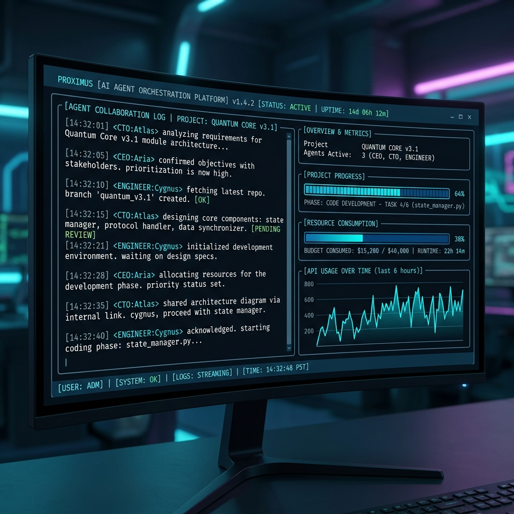
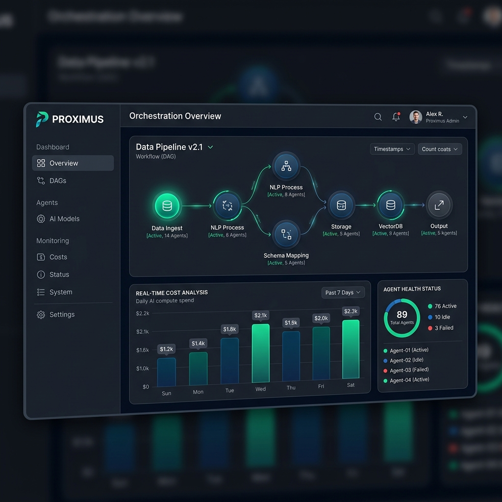

# Proximus — Autonomous Multi-Agent AI Organization


[](https://go.dev/)
[](https://www.python.org/)
[](https://nextjs.org/)
[](https://kafka.apache.org/)
[](LICENSE)

> A production-grade, event-driven system where a team of specialized AI agents autonomously plan, build, test, and ship real software from a single business idea.

---

## 📚 Documentation Index

Before diving in, please review the specialized documentation tailored to your role:

| Document | Use Case |
| :--- | :--- |
| **[Developer Hub](./docs/DEVELOPER_HUB.md)** | **Start Here.** Central technical entry point for all contributors. |
| **[Architecture Guide](./docs/architecture.md)** | Deep-dive into the high-level system design and asynchronous data flow. |
| **[Desktop Mastery](./docs/DESKTOP_MASTERY.md)** | Learn how the local standalone Python engine (Desktop Nova) works. |
| **[Enterprise SaaS Guide](./docs/ENTERPRISE_SAS_GUIDE.md)** | Setup and scaling guide for the Go/Kafka distributed cloud stack. |
| **[API Reference](./docs/API_REFERENCE.md)** | Comprehensive list of Go Gateway REST routes and WebSocket events. |
| **[Priorities & Roadmap](./docs/PRIORITIES.md)** | Current project focus areas and planned features. |
| **[Technical Audit](./docs/feedback.md)** | Results of the latest security and code quality audit. |

---

## 🖥️ Interface Previews

Proximus offers two world-class interfaces for managing your autonomous organization.

| **Interactive TUI Shell** | **Enterprise Management Dashboard** |
| :---: | :---: |
|  |  |
| *Real-time agent collaboration logs and system telemetry.* | *Visual Task DAG, cost analytics, and fleet management.* |

---

## 🔄 Project Workflow & Lifecycle

Proximus operates as a coordinated swarm. Below is the end-to-end execution flow for a typical software project mission:


---

## 🧠 The Specialized Agent Swarm

Each agent in Proximus is a specialist with unique capabilities and toolsets.

### 👔 Strategic Leadership
*   **CEO Agent**: Analyzes business ideas, performs market feasibility studies, and generates high-level project roadmaps.
*   **CTO Agent**: Defines technical stacks, designs system architectures, and sets the "North Star" for all engineering tasks.

### 🛠️ Core Engineering
*   **Backend Engineer**: Implements high-performance Go and Python microservices with a focus on concurrency and reliability.
*   **Frontend Engineer**: Builds responsive, modern UIs using Next.js 15 and Tailwind CSS, following accessibility standards.

### 🛡️ Quality & Operations
*   **QA Agent**: Validates all generated code within isolated **Docker Sandboxes**, ensuring 100% test coverage before delivery.
*   **DevOps Agent**: Orchestrates containerization, manages CI/CD pipelines, and automates AWS cloud deployments.
*   **Finance Agent**: The project's "Budget Guard," monitoring LLM token consumption and infrastructure costs in real-time.

---

## ✨ The Proximus Advantage

Why choose Proximus for autonomous software engineering?

*   **Surgical Precision**: Agents modify source code with minimal side effects, preserving developer intent and project style.
*   **Security-First Architecture**: 
    *   **AST Validation**: AI-generated code is analyzed for security risks in Rust before it ever touches your disk.
    *   **PII Scrubbing**: Automatic log redaction keeps sensitive API keys and user data private.
*   **Mixture of Experts (MoE)**: Our Rust-based routing engine dynamically selects the most cost-effective LLM for each specific task.
*   **Budget Governance**: Real-time spending limits and token quotas prevent unexpected API bills.

---

## 📂 Project Structure

```text
.
├── agents/             # Specialist AI Agent definitions (Python)
├── api/                # Python API endpoints for Desktop mode
├── assets/             # Images and branding assets
├── dashboard/          # Next.js 15 Management Dashboard
├── docs/               # Detailed technical documentation hub
├── go-backend/         # Enterprise microservices (Go)
├── infra/              # Kubernetes Helm charts and Terraform
├── messaging/          # Kafka schemas and client implementations
├── moe-scoring/        # Rust-based routing engine
├── orchestrator/       # Python DAG execution engine
├── scripts/            # Utility and maintenance scripts
├── security-check/     # Rust-based security validation services
├── tests/              # Unit and integration test suites
├── tools/              # MCP-compliant tool implementations
└── tui.py              # Interactive Terminal UI
```

---

## 🚀 Quick Start

### 1. Setup
```bash
git clone https://github.com/DsThakurRawat/Autonomous-Multi-Agent-AI-Organization.git
cd "Autonomous Multi-Agent AI Organization"
cp .env.example .env # Add your LLM API keys
```

### 2. Launch
*   **TUI Mode**: `python3 tui.py`
*   **CLI Mode**: `python3 desktop_nova.py "Build a real-time weather dashboard"`

---

## ❓ Frequently Asked Questions

<details>
<summary><b>Which LLMs does Proximus support?</b></summary>
Proximus is provider-agnostic. While it is optimized for <b>Amazon Nova</b> models on Bedrock, it supports OpenAI, Anthropic, and Google Gemini. You can configure per-agent model preferences in the <code>dashboard/settings</code> page.
</details>

<details>
<summary><b>Is it safe to run AI-generated code?</b></summary>
Yes. Proximus uses a multi-layered security approach:
1. All code is run in an isolated <b>Docker Sandbox</b>.
2. A Rust-based <b>AST Validator</b> checks for malicious patterns before execution.
3. An <b>Egress Proxy</b> restricts network access to a strict allowlist.
</details>

<details>
<summary><b>How does the budget gating work?</b></summary>
The <b>Finance Agent</b> tracks every token and API call. If a project exceeds the pre-defined budget threshold, the Orchestrator automatically pauses the swarm and requests human intervention.
</details>

---

## 🤝 Contributing
Please see **[CONTRIBUTING.md](./CONTRIBUTING.md)** for standards and **[SETUP.md](./SETUP.md)** for local development environment configuration.

## 📄 License
MIT — see `LICENSE` for details.
