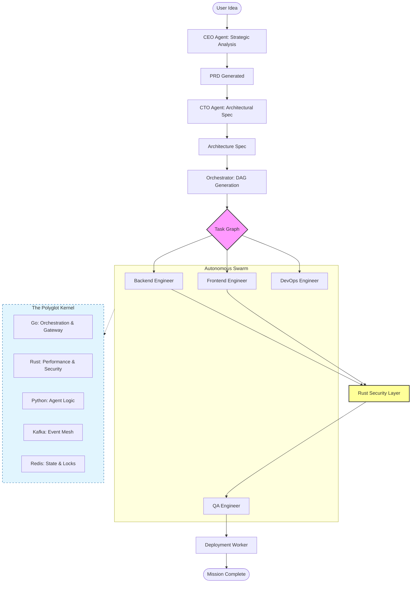

# Proximus — Autonomous Multi-Agent AI Organization


[](https://go.dev/)
[](https://www.python.org/)
[](https://nextjs.org/)
[](https://kafka.apache.org/)
[](LICENSE)

> A production-grade, event-driven system where a team of specialized AI agents autonomously plan, build, test, and ship real software from a single business idea.

---

## 📚 Documentation Hub

Explore our exhaustive documentation suite, covering every layer of the Proximus stack:

| Category | Primary Guide | Use Case |
| :--- | :--- | :--- |
| **🚀 Start** | **[Developer Hub](./docs/DEVELOPER_HUB.md)** | **Central entry point.** Onboarding, setup, and contribution standards. |
| **🏗️ Design** | **[Architecture Guide](./docs/architecture.md)** | High-level system design, data flow, and polyglot kernel details. |
| **💻 Local** | **[Desktop Mastery](./docs/DESKTOP_MASTERY.md)** | Internals of the local standalone Python engine (Desktop Nova). |
| **☁️ SaaS** | **[Enterprise Guide](./docs/ENTERPRISE_SAS_GUIDE.md)** | Scaling the Go/Kafka stack with Kubernetes and Docker. |
| **📡 API** | **[API Reference](./docs/API_REFERENCE.md)** | OpenAPI specs for Go Gateway and WebSocket event schemas. |
| **🗺️ Strategy** | **[Priorities & Roadmap](./docs/PRIORITIES.md)** | Core milestones, feature status, and technical debt log. |
| **🛡️ Audit** | **[Technical Audit](./docs/feedback.md)** | Deep-dive review of security, performance, and reliability bottlenecks. |
| **🤝 Workflow** | **[PR Orchestration](./docs/pr_orchestration_guide.md)** | How we manage PRs, branch conventions, and CI/CD gates. |

---

## 🖥️ Interface Previews

Proximus offers two world-class interfaces for managing your autonomous organization.

| **Interactive TUI Shell** | **Enterprise Management Dashboard** |
| :---: | :---: |
|  |  |
| *Real-time agent collaboration logs and system telemetry.* | *Visual Task DAG, cost analytics, and fleet management.* |

---

## 🔄 The Autonomous Lifecycle (Mission Workflow)

Proximus operates as a high-frequency trading desk for software engineering, moving through 7 granular phases of execution.



### 1. Strategic Ingestion (CEO)
The **CEO Agent** analyzes the business idea, performs market feasibility checks, and defines the MVP (Minimum Viable Product). It emits a structured **Product Requirements Document (PRD)** into the Kafka event mesh.

### 2. Architectural Blueprinting (CTO)
The **CTO Agent** consumes the PRD and designs a technical architecture. It selects the tech stack, defines API contracts, and creates a data schema. This phase includes a **pre-flight budget gate** to ensure the design is cost-viable.

### 3. Dynamic DAG Synthesis (Orchestrator)
The **Orchestrator** uses a specialized LLM planner to convert the Architecture Spec into a **Directed Acyclic Graph (DAG)** of parallelizable tasks. It calculates the **Critical Path** to optimize execution time.

### 4. Parallel Build Swarm (Engineers)
Specialized agents (Backend, Frontend, DevOps) execute tasks in parallel.
*   **The Reasoning Loop**: Thinking → Tool Use → Result.
*   **Shadow Git Checkpointing**: Every task's output is committed to a temporary shadow branch for instant rollback or human review.
*   **Human Authorization**: High-risk actions (e.g., cloud provisioning) trigger a real-time approval request via the Dashboard.

### 5. Multi-Layer Security Perimeter (Rust)
Every line of code and log entry passes through our high-performance **Rust Kernel**:
*   **AST Validation**: AI-generated code is checked for malicious patterns (e.g., unexpected network calls) before execution.
*   **PII Redaction**: Logs are scrubbed of credentials and sensitive data in microseconds.

### 6. Automated QA & Sandbox Testing (QA)
The **QA Agent** generates unit and integration tests. Code is executed in an isolated **Docker Sandbox** where API contracts are validated and security vulnerabilities are scanned.

### 7. Post-Deployment Reflection (Self-Critique)
After the "Mission Complete" event, every agent enters a **Reflection Loop**. They review their own work, score it against quality metrics, and log "lessons learned" for future tasks.

---

## 🏗️ Core Subsystems & Components

### 🧠 Intelligence Kernel
- **Model Context Protocol (MCP)**: A standardized interface for agents to use tools (Sandboxes, File Systems, Web Browsers).
- **Semantic Caching**: A Redis-backed vector cache that bypasses LLM calls for repetitive thoughts, reducing cost by up to 40%.
- **Mixture of Experts (MoE)**: Intelligent routing that matches tasks to the most efficient model (e.g., Nova Lite for linting, Nova Pro for architecture).

### ⚙️ Orchestration Layer
- **Go Enterprise Gateway**: A high-concurrency entry point with JWT auth, rate limiting, and WebSocket synchronization.
- **Kafka Event Mesh**: Validated topics for tasks, results, heartbeats, and audit logs.
- **Resiliency Engine**: Built-in exponential backoff retries and "Saga" pattern for distributed transaction rollbacks.

### 📊 Observability & Governance
- **Precision Cost Ledger**: Real-time USD tracking per task, agent, and project.
- **OpenTelemetry (OTEL)**: End-to-end tracing with Jaeger and metrics collection via Prometheus/Grafana.
- **KEDA Autoscaling**: Kubernetes-native autoscaling that spins up agent pods based on Kafka queue depth.

---

## 📂 Deep Repository Map

```text
.
├── agents/             # Reasoning: BaseAgent, Specialist Swarm, AgentLoop
├── api/                # Desktop: Python FastAPI local interface
├── assets/             # Branding: Banners, UI Previews, Diagrams
├── dashboard/          # Dashboard: Next.js 15, Tailwind, React Flow (DAG)
├── docs/               # Docs: Comprehensive technical documentation hub
├── go-backend/         # Cloud: Go microservices (Gateway, Tenant, Metrics)
├── infra/              # Deployment: Helm, KEDA, K8s manifests, Terraform
├── messaging/          # Backbone: Kafka schemas, producers/consumers
├── moe-scoring/        # Intelligent Routing: Rust Vector Scorer
├── monitoring/         # Dashboarding: Prometheus, Grafana dashboards
├── observability/      # Telemetry: OpenTelemetry, Tracing (Jaeger)
├── orchestrator/       # The Brain: DAG Planner, Memory, Shadow Git
├── security-check/     # Perimeter: Rust AST Validation, PII Scrubbing
├── tests/              # Validation: Unit, Integration, E2E Lifecycle
├── tools/              # MCP Tools: Docker Sandbox, Git, Linter, Browser
└── tui.py              # Interface: Interactive Terminal UI
```

---

## 🚀 Quick Start & Deployment

### 1. Requirements
- **Python 3.12+** | **Go 1.25+** | **Rust 1.75+**
- **Docker & Docker Compose**

### 2. Launch
*   **Standalone (Desktop Nova)**: `python3 tui.py`
*   **Enterprise Cluster**: `docker-compose up -d`

---

## ❓ Frequently Asked Questions

<details>
<summary><b>How does Proximus ensure code quality?</b></summary>
Every task goes through a "Triple-Gate" process: (1) Rust AST Validation, (2) QA Sandbox Testing, and (3) Autonomous Self-Critique.
</details>

<details>
<summary><b>Can I use local models like Llama 3?</b></summary>
Yes. Proximus is provider-agnostic. You can point the LLM client to any OpenAI-compatible local server (e.g., Ollama or vLLM).
</details>

---

## 🤝 Community & Contributing
Please see **[CONTRIBUTING.md](./CONTRIBUTING.md)** and **[SETUP.md](./SETUP.md)** for details.

## 📄 License
MIT — see `LICENSE` for details.
