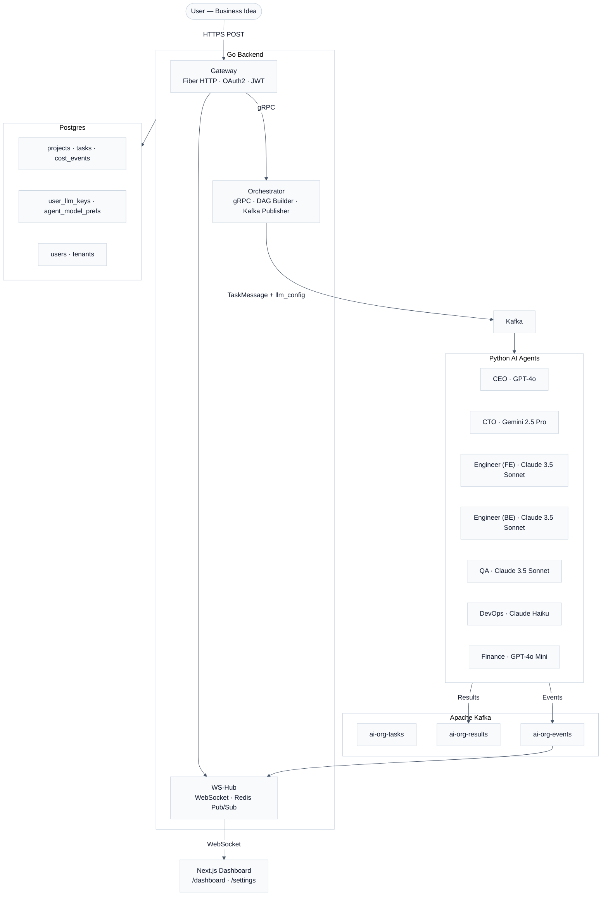

# Autonomous Multi-Agent AI Organization

[](https://go.dev/)
[](https://www.python.org/)
[](https://nextjs.org/)
[](https://kafka.apache.org/)
[](https://www.postgresql.org/)
[](LICENSE)
[](https://github.com/DsThakurRawat/Autonomous-Multi-Agent-AI-Organization/actions/workflows/go-ci.yml)
[](https://github.com/DsThakurRawat/Autonomous-Multi-Agent-AI-Organization/actions/workflows/frontend-ci.yml)
[](https://github.com/DsThakurRawat/Autonomous-Multi-Agent-AI-Organization/actions/workflows/rust-ci.yml)

> A production-grade, event-driven system where a team of specialized AI agents autonomously plan, build, test, and ship real software from a single business idea — with a real-time web dashboard and zero-friction local setup.

---

## 🚀 What It Does

You type a business idea. The system:

1. **CEO Agent** — Researches the market, defines scope and requirements
2. **CTO Agent** — Designs the system architecture and database schema
3. **Frontend Engineer Agent** — Writes React/TypeScript/CSS code and responsive layouts
4. **Backend Engineer Agent** — Writes Python/Go APIs, database schemas, and logic
5. **QA Agent** — Runs tests, detects edge cases and bugs
6. **DevOps Agent** — Generates Terraform, Kubernetes manifests, CI/CD pipelines
7. **Finance Agent** — Tracks token usage and enforces budget limits

Every agent runs asynchronously over Kafka. You watch it all happen live in the dashboard.

---

## 🏗 Architecture



---

## 🛠 Tech Stack

| Layer             | Technology                                |
| ----------------- | ----------------------------------------- |
| **API Gateway**   | Go 1.22 · Fiber v2                        |
| **Orchestrator**  | Go · gRPC · DAG engine                    |
| **WebSocket Hub** | Go · Redis Pub/Sub                        |
| **AI Agents**     | Python 3.11 · OpenAI / Anthropic / Google |
| **Event Bus**     | Apache Kafka · ZooKeeper                  |
| **Database**      | PostgreSQL 15 · pgcrypto                  |
| **Cache**         | Redis 7                                   |
| **Dashboard**     | Next.js 14 · TypeScript                   |
| **MoE Routing**   | Rust (sub-ms expert scoring)              |
| **Auth (SaaS)**   | Google OAuth2 · RS256 JWT                 |
| **Auth (Local)**  | None — straight to dashboard              |
| **Infra**         | Docker Compose · Helm · Terraform         |

---

## ⚡ Quick Start

### Option A — Local / Self-Hosted (No login required)

Fastest way to run the full system on your own machine.

**Prerequisites:** Docker + Docker Compose, `openssl`

```bash
# 1. Clone
git clone https://github.com/DsThakurRawat/Autonomous-Multi-Agent-AI-Organization.git
cd "Autonomous Multi-Agent AI Organization"

# 2. Copy local env template
cp .env.local.example .env.local

# 3. Generate an encryption key and add it to .env.local
openssl rand -hex 32
# Paste output as KEY_ENCRYPTION_KEY= in .env.local
# Also add at least one LLM key: OPENAI_API_KEY, ANTHROPIC_API_KEY, or GOOGLE_API_KEY

# 4. Start the full stack (Go services + all 7 agents + dashboard + infra)
docker-compose -f go-backend/deploy/docker-compose.local.yml --env-file .env.local up --build

# 5. Open the dashboard — no login prompt
open http://localhost:3000
```

**That's it.** No Google Cloud Console. No JWT keys. No login screen.

---

### Option B — SaaS / Hosted (Google OAuth login)

For deploying on a server where multiple users sign in with Google accounts.

**Prerequisites:** Docker, a domain, Google Cloud Console app

```bash
# 1. Clone
git clone https://github.com/DsThakurRawat/Autonomous-Multi-Agent-AI-Organization.git
cd "Autonomous Multi-Agent AI Organization"

# 2. Copy SaaS env template
cp .env.example .env

# 3. Generate RSA keys for JWT signing
mkdir -p keys
openssl genrsa -out keys/private.pem 2048
openssl rsa -in keys/private.pem -pubout -out keys/public.pem

# 4. Generate encryption key
openssl rand -hex 32   # → paste as KEY_ENCRYPTION_KEY in .env

# 5. Fill in Google OAuth credentials in .env
#    Create at: https://console.cloud.google.com/apis/credentials
#    Authorized redirect URI: https://yourdomain.com/auth/google/callback

# 6. Fill in LLM API keys in .env (platform-wide defaults)

# 7. Start
docker-compose -f go-backend/deploy/docker-compose.yml up --build

# 8. Open
open https://yourdomain.com
```

Users land on a login page → **Sign in with Google** → redirected to their dashboard.

---

## ⚙️ Environment Variables

### Local Mode (`.env.local`)

| Variable             | Required     | Description                                    |
| -------------------- | ------------ | ---------------------------------------------- |
| `AUTH_DISABLED`      | ✅           | Set to `true` — skips all auth                 |
| `KEY_ENCRYPTION_KEY` | ✅           | 64-char hex (32 bytes). `openssl rand -hex 32` |
| `OPENAI_API_KEY`     | one of these | Your OpenAI, Anthropic, or Google API key      |
| `ANTHROPIC_API_KEY`  | one of these |                                                |
| `GOOGLE_API_KEY`     | one of these |                                                |

### SaaS Mode (`.env`)

All local vars above, plus:

| Variable               | Required | Description                                   |
| ---------------------- | -------- | --------------------------------------------- |
| `AUTH_DISABLED`        | ✅       | Set to `false`                                |
| `GOOGLE_CLIENT_ID`     | ✅       | From Google Cloud Console                     |
| `GOOGLE_CLIENT_SECRET` | ✅       | From Google Cloud Console                     |
| `GOOGLE_REDIRECT_URL`  | ✅       | `https://yourdomain.com/auth/google/callback` |
| `JWT_PRIVATE_KEY_PATH` | ✅       | Path to `keys/private.pem`                    |
| `JWT_PUBLIC_KEY_PATH`  | ✅       | Path to `keys/public.pem`                     |
| `JWT_EXPIRY`           |          | Default: `168h` (7 days)                      |

---

## 🌐 API Routes (Go Gateway — port 8080)

| Method   | Path                             | Description                         |
| -------- | -------------------------------- | ----------------------------------- |
| `GET`    | `/healthz`                       | Health check                        |
| `GET`    | `/auth/google`                   | Initiate Google OAuth (SaaS mode)   |
| `GET`    | `/auth/google/callback`          | OAuth callback → JWT cookie         |
| `POST`   | `/v1/projects`                   | Create a new project                |
| `GET`    | `/v1/projects`                   | List your projects                  |
| `GET`    | `/v1/projects/:id`               | Get project detail + task counts    |
| `DELETE` | `/v1/projects/:id`               | Cancel a project                    |
| `GET`    | `/v1/projects/:id/tasks`         | DAG task list (for DagViewer)       |
| `GET`    | `/v1/projects/:id/events`        | Recent agent event log              |
| `GET`    | `/v1/projects/:id/cost`          | Cost breakdown per agent            |
| `POST`   | `/v1/settings/keys`              | Add encrypted LLM API key           |
| `GET`    | `/v1/settings/keys`              | List stored key labels              |
| `DELETE` | `/v1/settings/keys/:id`          | Delete a stored key                 |
| `POST`   | `/v1/settings/agent-prefs`       | Set model preference per agent role |
| `GET`    | `/v1/settings/agent-prefs`       | Get all agent model preferences     |
| `DELETE` | `/v1/settings/agent-prefs/:role` | Reset agent to default model        |

---

## 🧠 LLM Configuration

### Default Models (no configuration needed)

| Agent         | Provider  | Model                      |
| ------------- | --------- | -------------------------- |
| CEO           | OpenAI    | `gpt-4o`                   |
| CTO           | Google    | `gemini-2.5-pro-exp-03-25` |
| Engineer (BE) | Anthropic | `claude-3-5-sonnet-latest` |
| Engineer (FE) | Anthropic | `claude-3-5-sonnet-latest` |
| QA            | Anthropic | `claude-3-5-sonnet-latest` |
| DevOps        | Anthropic | `claude-haiku-20240307`    |
| Finance       | OpenAI    | `gpt-4o-mini`              |

### Per-User Key Management

In the dashboard → **Settings**, users can:

- Add multiple API keys per provider (stored AES-256-GCM encrypted)
- Override which model each agent role uses
- Select which stored key each agent uses

The resolution order per task:

1. User's agent-specific preference → their stored key
2. User's stored key for the provider (first valid)
3. Server environment variable (`OPENAI_API_KEY`, etc.)
4. Error if none available

---

## 🗄️ Database Migrations

Migrations run automatically in the local Docker Compose stack.

```bash
# Run manually
migrate -path go-backend/migrations -database "$DATABASE_URL" up

# Rollback last migration
migrate -path go-backend/migrations -database "$DATABASE_URL" down 1
```

| Migration           | Contents                                                                    |
| ------------------- | --------------------------------------------------------------------------- |
| `001_init`          | Core schema: tenants, users, projects, tasks, cost_events, agent_heartbeats |
| `002_user_llm_keys` | user_llm_keys + agent_model_prefs tables                                    |
| `003_user_auth`     | users.updated_at + `upsert_google_user()` PG function (atomic OAuth login)  |
| `004_projects_name` | projects.name column (backfilled from idea)                                 |

---

## 📊 Dashboard

Access at `http://localhost:3000`

| Page         | What's there                                                        |
| ------------ | ------------------------------------------------------------------- |
| `/`          | Landing page / Google Sign-In (SaaS mode)                           |
| `/dashboard` | Project list, create project, live agent feed, task DAG, cost meter |
| `/settings`  | Manage LLM API keys + per-agent model preferences                   |

---

## 📁 Project Structure

```text
├── go-backend/               Go microservices
│   ├── cmd/
│   │   ├── gateway/          HTTP API (Fiber) — auth, routing, websockets
│   │   ├── health-monitor/   System health monitoring
│   │   ├── metrics-svc/      Metrics tracking service
│   │   ├── orchestrator/     gRPC server — DAG planning, Kafka dispatch
│   │   ├── tenant-svc/       Tenant management
│   │   └── ws-hub/           WebSocket server — Redis pub/sub
│   ├── internal/
│   │   ├── gateway/handler/  HTTP handlers (projects, tasks, settings, OAuth)
│   │   ├── gateway/middleware/  Auth (JWT + Local), CORS, rate limiting
│   │   ├── orchestrator/     DAG engine + gRPC server
│   │   └── shared/           auth, config, db, kafka, keystore, logger, redis
│   ├── migrations/           SQL migrations (001–004)
│   └── deploy/
│       ├── docker-compose.yml        SaaS mode
│       ├── docker-compose.local.yml  Local mode (no login)
│       └── dockerfiles/
├── agents/                   Python AI agents
│   ├── base_agent.py         Multi-provider LLM caller (OpenAI/Anthropic/Google)
│   ├── agent_service.py      Kafka consumer + per-task LLM resolution
│   ├── model_registry.py     Default model configs per agent role
│   ├── ceo_agent.py
│   ├── cto_agent.py
│   ├── engineer_agent.py     (Handles FE and BE roles)
│   ├── qa_agent.py
│   ├── devops_agent.py
│   └── finance_agent.py
├── dashboard/                Next.js 14 frontend
│   ├── app/
│   │   ├── page.tsx          Landing / login page
│   │   ├── dashboard/        Main dashboard
│   │   └── settings/         LLM key + model preference management
│   └── lib/api.ts            Typed API client
├── moe-scoring/              Rust — sub-ms expert routing engine
├── infra/
│   ├── helm/                 Kubernetes Helm charts
│   └── terraform/            AWS infrastructure (ECS, RDS, Route53)
├── api/                      API definitions and specs
├── infrastructure/           IaC files and definitions
├── k8s/                      Additional Kubernetes manifests
├── messaging/                Kafka schemas and clients
├── monitoring/               Monitoring configurations
├── observability/            Tracing and metrics
├── orchestrator/             Python orchestrator logic
├── output/                   Log/artifact outputs
├── tests/                    Test scripts
├── tools/                    Shared agent tools
├── utils/                    Shared utility functions
├── docker-compose.yml        Root compose file (SaaS)
├── docker-compose.observability.yml Metrics and Observability
├── .env.example              SaaS mode env template
├── .env.local.example        Local mode env template
├── requirements.txt          Python dependencies
└── Dockerfile.agent          Python agent container image
```

---

## ☸️ Kubernetes Deployment

```bash
cd infra/helm/ai-org
helm install ai-org . --namespace ai-org-system --create-namespace \
  --set gateway.env.AUTH_DISABLED=false \
  --set gateway.env.GOOGLE_CLIENT_ID=<your-id> \
  --set gateway.env.GOOGLE_CLIENT_SECRET=<your-secret>
```

## ☁️ Terraform (AWS)

```bash
cd infra/terraform
terraform init
terraform plan
terraform apply
```

Provisions: ECS Fargate, RDS Postgres, ElastiCache Redis, MSK Kafka, Route53, ALB.

---

## 🔒 Security

- **Encrypted API keys** — AES-256-GCM. Raw keys never written to disk.
- **`key_hint`** — Only last 4 chars of a key are stored unencrypted (safe for UI display).
- **RS256 JWT** — Asymmetric signing. Private key never leaves the server.
- **CSRF protection** — OAuth state token validated via HttpOnly cookie.
- **HttpOnly JWT cookie** — Immune to XSS token theft.
- **Agent sandboxing** — Code execution runs in isolated Docker containers with `--network=none`.
- **Least privilege** — CEO cannot write code; Engineer cannot modify billing.

---

## 🤝 Contributing

1. Fork the repository
2. Create a feature branch: `git checkout -b feature/your-feature`
3. Commit with a descriptive message
4. Push and open a Pull Request against `main`

Please run before submitting:

```bash
cd go-backend && go build ./... && go vet ./...
cd dashboard && npx tsc --noEmit
python3 -m py_compile agents/*.py
```

---

## 📄 License

MIT — see `LICENSE` for details.
