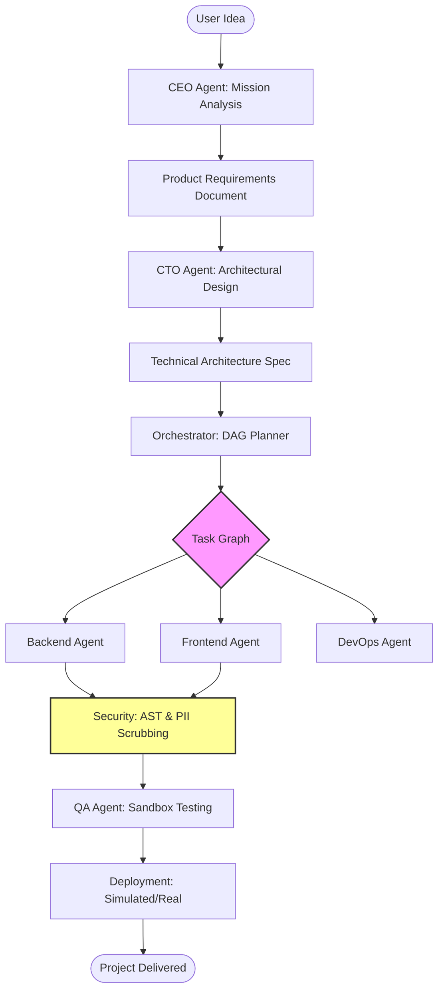

# Proximus — Autonomous Multi-Agent AI Organization


[](https://go.dev/)
[](https://www.python.org/)
[](https://nextjs.org/)
[](https://kafka.apache.org/)
[](LICENSE)

> A production-grade, event-driven system where a team of specialized AI agents autonomously plan, build, test, and ship real software from a single business idea.

---

## 📚 Documentation Index

Before diving in, please review the specialized documentation tailored to your role:

| Document | Use Case |
| :--- | :--- |
| **[Developer Hub](./docs/DEVELOPER_HUB.md)** | **Start Here.** Central technical entry point for all contributors. |
| **[Architecture Guide](./docs/architecture.md)** | Deep-dive into the high-level system design and asynchronous data flow. |
| **[Desktop Mastery](./docs/DESKTOP_MASTERY.md)** | Learn how the local standalone Python engine (Desktop Nova) works. |
| **[Enterprise SaaS Guide](./docs/ENTERPRISE_SAS_GUIDE.md)** | Setup and scaling guide for the Go/Kafka distributed cloud stack. |
| **[API Reference](./docs/API_REFERENCE.md)** | Comprehensive list of Go Gateway REST routes and WebSocket events. |
| **[Priorities & Roadmap](./docs/PRIORITIES.md)** | Current project focus areas and planned features. |
| **[Technical Audit](./docs/feedback.md)** | Results of the latest security and code quality audit. |

---

## 🔄 Project Workflow & Lifecycle

Proximus operates as a coordinated swarm. Below is the end-to-end execution flow for a typical software project mission:



---

## 🏗️ Core Subsystems

### 1. The Orchestrator (`/orchestrator`)
The "Brain" of the organization. It manages the **Task Graph (DAG)**, tracking dependencies and ensuring that agents work in the correct sequence. It handles state persistence, checkpointing, and error recovery.

### 2. The Agent Swarm (`/agents`)
Specialized AI personas powered by **Amazon Nova** (default) or other LLMs. Each agent is equipped with a specific set of tools via the **Model Context Protocol (MCP)**.
- **CEO/CTO**: Strategy and Design.
- **Engineers**: Implementation (Go, Python, Next.js).
- **QA**: Automated testing in isolated Docker sandboxes.

### 3. Security & Governance (`/security-check` & `/moe-scoring`)
- **AST Validation**: Rust-based service that analyzes AI-generated code for security vulnerabilities before execution.
- **PII Redaction**: High-performance log scrubbing to prevent leakage of sensitive data.
- **Mixture of Experts (MoE)**: Optimized routing that selects the best model for each specific task based on historical performance and cost.

---

## 📂 Project Structure

```text
.
├── agents/             # Specialist AI Agent definitions (Python)
├── api/                # Python API endpoints for Desktop mode
├── assets/             # Images and branding assets
├── dashboard/          # Next.js 15 Management Dashboard
├── docs/               # Detailed technical documentation hub
├── go-backend/         # Enterprise microservices (Go)
│   ├── cmd/            # Entry points (Gateway, Orchestrator, MCP)
│   ├── internal/       # Core Go logic and shared libraries
│   └── migrations/     # PostgreSQL schema migrations
├── infra/              # Kubernetes Helm charts and Terraform
├── messaging/          # Kafka schemas and client implementations
├── moe-scoring/        # Rust-based routing engine
├── orchestrator/       # Python DAG execution engine
├── scripts/            # Utility and maintenance scripts
├── security-check/     # Rust-based security validation services
├── tests/              # Unit and integration test suites
├── tools/              # MCP-compliant tool implementations
└── tui.py              # Interactive Terminal UI
```

---

## 🚀 Quick Start

### 1. Setup
```bash
git clone https://github.com/DsThakurRawat/Autonomous-Multi-Agent-AI-Organization.git
cd "Autonomous Multi-Agent AI Organization"
cp .env.example .env # Add your LLM API keys
```

### 2. Launch
*   **TUI Mode**: `python3 tui.py`
*   **CLI Mode**: `python3 desktop_nova.py "Build a real-time weather dashboard"`

---

## 🤝 Contributing
Please see **[CONTRIBUTING.md](./CONTRIBUTING.md)** for standards and **[SETUP.md](./SETUP.md)** for local development environment configuration.

## 📄 License
MIT — see `LICENSE` for details.
