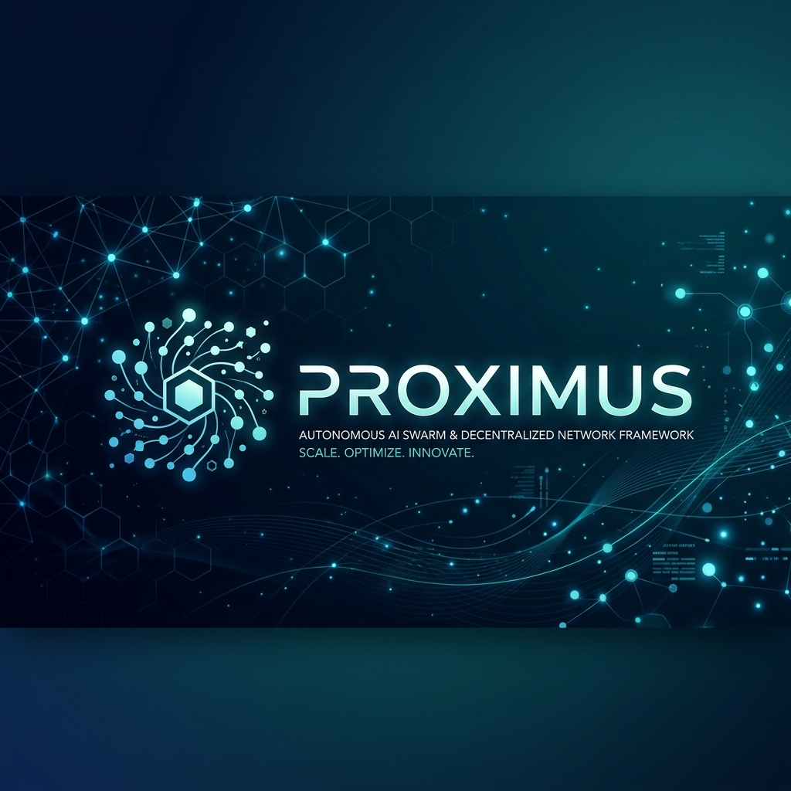

# Proximus — Autonomous Multi-Agent AI Organization



[](https://go.dev/)
[](https://www.python.org/)
[](https://nextjs.org/)
[](https://kafka.apache.org/)
[](LICENSE)

> A production-grade, event-driven system where a team of specialized AI agents autonomously plan, build, test, and ship real software from a single business idea.

---

## 📚 Documentation Hub

Explore our exhaustive documentation suite, covering every layer of the Proximus stack:

| Category | Primary Guide | Use Case |
| :--- | :--- | :--- |
| **🚀 Start** | **[Developer Hub](./docs/DEVELOPER_HUB.md)** | **Central entry point.** Onboarding, setup, and contribution standards. |
| **🏗️ Design** | **[Architecture Guide](./docs/architecture.md)** | High-level system design, data flow, and polyglot kernel details. |
| **💻 Local** | **[Desktop Mastery](./docs/DESKTOP_MASTERY.md)** | Internals of the local standalone Python engine (Desktop Nova). |
| **☁️ SaaS** | **[Enterprise Guide](./docs/ENTERPRISE_SAS_GUIDE.md)** | Scaling the Go/Kafka stack with Kubernetes and Docker. |
| **📡 API** | **[API Reference](./docs/API_REFERENCE.md)** | OpenAPI specs for Go Gateway and WebSocket event schemas. |
| **🗺️ Strategy** | **[Priorities & Roadmap](./docs/PRIORITIES.md)** | Core milestones, feature status, and technical debt log. |
| **🛡️ Audit** | **[Technical Audit](./docs/feedback.md)** | Deep-dive review of security, performance, and reliability bottlenecks. |
| **🤝 Workflow** | **[PR Orchestration](./docs/pr_orchestration_guide.md)** | How we manage PRs, branch conventions, and CI/CD gates. |

---

## 🔄 The Proximus Execution Lifecycle

Proximus operates as a coordinated swarm of experts synchronized via a central task graph.


---

## 🏗️ Core Subsystems & Components

Proximus is a sophisticated "Operating System" for AI agents, built with industrial-grade technologies.

### 🧠 1. Intelligence & Agents (`/agents`)
The reasoning engine of the organization, powered by **Amazon Nova** (default) or any provider-agnostic LLM.
- **CEO & CTO**: High-level planning, requirements extraction, and architecture design.
- **Engineer Swarm**: Specialized agents for Backend (Go/Python), Frontend (Next.js/React), and DevOps (K8s/Terraform).
- **AgentLoop**: A custom execution engine that handles tool use, self-critique, and iterative fixes.

### ⚖️ 2. Orchestration & State (`/orchestrator` & `/go-backend`)
The central nervous system that coordinates parallel task execution.
- **DAG Planner**: Converts architectural specs into a Directed Acyclic Graph of parallelizable tasks.
- **Task Scheduler**: Distributes tasks to agents via Kafka and manages worker pools.
- **Project Memory**: A multi-layered storage system (Postgres + Redis + Qdrant) for project state, artifacts, and semantic caching.

### 📡 3. Event Mesh & Messaging (`/messaging`)
A high-performance asynchronous backbone built on **Apache Kafka**.
- **Topics**: Strict schema-validated topics for tasks, results, events, and heartbeats.
- **DLQ (Dead Letter Queue)**: Built-in error handling for malformed or failed agent messages.
- **Websocket Hub**: Real-time broadcast of agent activity to the UI dashboard.

### 🛡️ 4. Security & Performance Perimeter (`/security-check` & `/moe-scoring`)
Low-latency services implemented in **Rust** to protect the system.
- **AST Validator**: Performs static analysis on AI-generated scripts to block malicious code.
- **PII Redactor**: High-speed log scrubbing to prevent leakage of credentials or sensitive data.
- **MoE Scoring**: A vector-native routing engine that selects the optimal agent/model for each task.

### 📊 5. Observability Hub (`/monitoring` & `/observability`)
Deep-dive tracking of system health and performance.
- **Metrics**: Prometheus & Grafana for tracking token usage, costs, and agent throughput.
- **Tracing**: OpenTelemetry (OTEL) integration with Jaeger for end-to-end request tracing.
- **Budget Gating**: Real-time financial governance with automatic kill-switches.

---

## 🛠️ Specialized Tooling (`/tools`)

Proximus agents leverage the **Model Context Protocol (MCP)** to interact with the real world safely:
- **Docker Sandbox**: Executes tests and untrusted code in isolated, short-lived containers.
- **Local File Edit**: Surgical modifications to source code using AST-aware patch logic.
- **Collaboration Tool**: A virtual "Whiteboard" for agents to share state and synchronize complex designs.
- **Git & Linter Tools**: Automated version control management and code quality enforcement.

---

## 📂 Deep Repository Map

```text
.
├── agents/             # Logic: BaseAgent, Specialist Swarm, AgentLoop
├── api/                # Desktop: Python FastAPI Gateway
├── assets/             # Branding: Banners, UI Previews, Diagrams
├── dashboard/          # UI: Next.js 15, Tailwind, React Flow (DAG)
├── docs/               # Docs: Comprehensive technical hub
├── go-backend/         # Cloud: Go microservices stack
│   ├── cmd/            # Entry: Gateway, Orchestrator, MCP Server
│   ├── internal/       # Core: Auth, Kafka, Redis, State Logic
│   └── migrations/     # DB: Postgres schema evolution
├── infra/              # Cloud-Native: Helm charts, KEDA, K8s manifests
├── messaging/          # Messaging: Kafka schemas, producers/consumers
├── moe/                # Intelligent Routing: Python Expert Registry
├── moe-scoring/        # Routing Engine: Rust Vector Scorer
├── monitoring/         # Observability: Prometheus, Grafana, Provisioning
├── observability/      # Telemetry: OpenTelemetry, Tracing, Metrics
├── orchestrator/       # Engine: DAG Planner, Memory, Task Graph
├── scripts/            # Utility: CI/CD, Maintenance, PR Tools
├── security-check/     # Security: Rust AST Validation, PII Scrubbing
├── tests/              # Testing: Unit, Integration, E2E Lifecycle
├── tools/              # MCP Tools: Docker, Git, Linter, Browser
└── tui.py              # Interface: Interactive Terminal UI
```

---

## 🚀 Quick Start & Deployment

### 1. Requirements
- **Python 3.12+** | **Go 1.25+** | **Rust 1.75+**
- **Docker & Docker Compose** (for Kafka/Postgres/Redis)

### 2. Launch
*   **Standalone (Desktop Nova)**: `python3 tui.py`
*   **Full Stack (Enterprise)**: `docker-compose up -d`

---

## 🤝 Community & Contributing
Please see **[CONTRIBUTING.md](./CONTRIBUTING.md)** for our strict code standards and **[SETUP.md](./SETUP.md)** for detailed environment configuration.

## 📄 License
MIT — see `LICENSE` for details.
