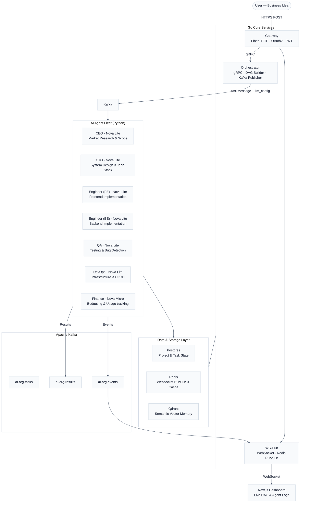

# System Architecture — Proximus

Proximus is a production-grade, event-driven multi-agent AI system designed to autonomously plan, build, test, and ship software projects from high-level business ideas.

---

## 🏗️ High-Level Overview

The system follows a microservices architecture with a Go-based core for high-performance orchestration and Python-based agents for AI reasoning.

---

## 🧱 Core Components

### 1. API Gateway (`go-backend/cmd/gateway`)

The gateway is the single entry point for all external traffic.

- **Authentication**: Supports both local mode (no login) and SaaS mode (Google OAuth2 + RS256 JWT).
- **Routing**: Proxies requests to internal services and manages project/task resources.
- **WebSockets**: Integrated with `ws-hub` to provide real-time updates to the dashboard.

### 2. Orchestrator (`go-backend/cmd/orchestrator`)

The brain of the system orchestration.

- **DAG Generation**: Converts a high-level goal into a Directed Acyclic Graph (DAG) of tasks.
- **Task Dispatch**: Broadcasts tasks to Kafka with specialized LLM configurations per agent role.
- **State Management**: Tracks project progress and coordinates agent hand-offs.

### 3. AI Agent Fleet (`agents/`)

Specialized Python workers that consume tasks from Kafka and execute them using LLMs.

- **Multi-Provider Support**: Backend support for Amazon Bedrock (Nova), OpenAI, Anthropic, and Google (Gemini).
- **Tool Use**: Agents can access shared tools (code execution, file system, web search) to perform their tasks.
- **Sandboxing**: Code execution is isolated using gVisor (`runsc`) for production security.

### 4. Event Bus (`messaging/`)

Apache Kafka serves as the backbone for asynchronous communication.

- **`ai-org-tasks`**: New tasks for agents.
- **`ai-org-results`**: Completed task data.
- **`ai-org-events`**: Real-time progress logs (streamed to UI via WebSockets).

### 5. Mixture of Experts (MoE) Routing (`moe-scoring/`)

A high-performance Rust service that routes tasks to the most efficient LLM or agent based on complexity and cost constraints.

---

## 🔄 Data Flow: From Idea to Code

1. **Submission**: User submits a business idea via the **Dashboard** or **TUI**.
2. **Orchestration**: The **Go Orchestrator** creates a multi-phase project plan (CEO → CTO → Engineers → QA → DevOps).
3. **Goal Definition**: The **CEO Agent** researches the idea and produces a PRD (Product Requirements Document).
4. **Technical Design**: The **CTO Agent** takes the PRD and defines the architecture, database schema, and technology stack.
5. **Implementation**: **Engineer Agents (FE/BE)** write the actual source code based on the technical design.
6. **Quality Assurance**: The **QA Agent** performs code review and executes tests.
7. **Deployment**: The **DevOps Agent** generates infrastructure-as-code (Terraform/K8s) to deploy the project.
8. **Completion**: The **Orchestrator** marks the project as complete, and the user is notified.

---

## 🛡️ Security & Reliability

- **Distributed Sagas**: Ensures atomic cross-service agent state transitions.
- **Distributed Tracing**: Full visibility via OpenTelemetry (Go, Python, Rust) integrated with LangSmith.
- **AST Validation**: AI-generated code is validated using a Rust-based parser before execution.
- **Egress Proxy**: Restricts agent network access to an allowlist of permitted domains.
