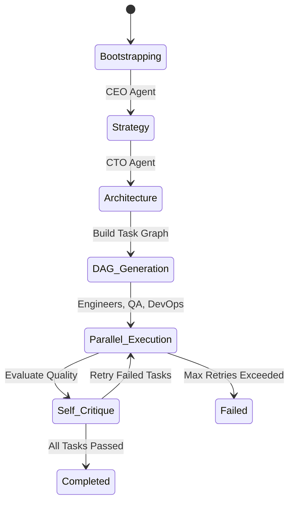

# Orchestrator Engine — Technical Reference

> **Module**: `orchestrator/`
> **Language**: Python 3.12
> **Key Dependencies**: `networkx`, `structlog`, `pydantic`, `asyncio`

---

## 1. Overview

The Orchestrator is the central brain of the Proximus system. It manages the complete project lifecycle — from receiving a raw business idea to delivering a fully deployed application. It coordinates all specialist agents through a Directed Acyclic Graph (DAG) of tasks, handles failures with retries and rollbacks, and broadcasts real-time execution events to the TUI and Dashboard.

---

## 2. Core Components

### 2.1. `OrchestratorEngine`

**Source**: [`orchestrator/planner.py`](../orchestrator/planner.py)

The top-level coordinator class. It maintains registries of agents, manages shared memory, and drives the project lifecycle.

**Key Responsibilities**:
-   Agent registration and lookup.
-   Project bootstrapping (initializing memory, cost ledger, artifacts).
-   Executing the 5-phase lifecycle as a background `asyncio.Task`.
-   Broadcasting `ExecutionEvent` objects to all subscribers (TUI, WebSocket).
-   Error recovery with fallback strategies when LLM calls fail.

**Lifecycle Phases**:



**API**:

| Method | Description |
| :--- | :--- |
| `register_agent(role, instance)` | Register a specialist agent for a given role. |
| `subscribe_events(callback)` | Subscribe an async/sync callback to receive `ExecutionEvent` objects. |
| `start_project(idea, constraints, budget)` | Entry point: kicks off the full lifecycle. Returns `project_id`. |
| `get_project_status(project_id)` | Returns current phase, task graph summary, and cost snapshot. |

---

### 2.2. `AgentExecutionContext`

**Source**: [`orchestrator/planner.py`](../orchestrator/planner.py) (line 27)

A runtime container injected into every agent's `run()` method. It provides access to all shared resources without global state.

**Fields**:

| Field | Type | Purpose |
| :--- | :--- | :--- |
| `project_id` | `str` | Unique identifier for the project. |
| `task` | `Task` | The specific task the agent is executing. |
| `memory` | `ProjectMemory` | Shared read/write state (business plan, architecture, files). |
| `decision_log` | `DecisionLog` | Append-only audit trail. |
| `cost_ledger` | `CostLedger` | Real-time budget governance. |
| `artifacts` | `ArtifactsStore` | File persistence and code mirroring. |
| `emit_event` | `Callable` | Callback to broadcast events to the TUI/Dashboard. |

---

### 2.3. `ExecutionEvent`

**Source**: [`orchestrator/planner.py`](../orchestrator/planner.py) (line 49)

A structured event object emitted during execution. These events drive the real-time TUI log, the Dashboard WebSocket feed, and the task status sidebar.

**Fields**: `id`, `event_type`, `agent_role`, `message`, `data`, `level`, `timestamp`.

**Event Types**:

| `event_type` | Emitted When |
| :--- | :--- |
| `system` | Project starts or stops. |
| `phase_change` | Lifecycle transitions (e.g., Strategy → Architecture). |
| `task_start` | An agent begins executing a task. |
| `task_completed` | An agent finishes a task successfully. |
| `task_failed` | An agent fails a task (will retry or abort). |
| `thinking` | An agent logs an intermediate reasoning step. |
| `budget_alert` | Cost exceeds 80% or 100% of budget. |
| `warning` | Non-critical issue (e.g., cost exceeds estimate). |

---

## 3. Task Graph Engine

**Source**: [`orchestrator/task_graph.py`](../orchestrator/task_graph.py)

### 3.1. `Task` (Pydantic Model)

Represents a single unit of work. Tasks are nodes in the DAG.

| Field | Type | Description |
| :--- | :--- | :--- |
| `id` | `str (UUID)` | Unique task identifier. |
| `name` | `str` | Human-readable task name (e.g., "Build Backend API"). |
| `description` | `str` | Detailed instructions for the agent. |
| `agent_role` | `str` | The `AgentRole` responsible for execution. |
| `status` | `TaskStatus` | Current lifecycle state (see enum below). |
| `priority` | `TaskPriority` | `CRITICAL(1)`, `HIGH(2)`, `MEDIUM(3)`, `LOW(4)`. |
| `dependencies` | `list[str]` | Task IDs that must complete before this task can start. |
| `retry_count` / `max_retries` | `int` | Automatic retry governance (default: 3 retries). |

**`TaskStatus` Enum**:
```
PENDING → QUEUED → IN_PROGRESS → COMPLETED
                                → FAILED → RETRYING → IN_PROGRESS
                                → BLOCKED (upstream failure)
                                → SKIPPED
```

### 3.2. `TaskGraph`

A DAG-based orchestration engine built on `networkx.DiGraph`. It provides:

-   **Cycle Detection**: `add_task()` validates that adding a new dependency does not create a cycle. If it does, the task is rejected.
-   **Ready Task Discovery**: `get_ready_tasks()` returns all `PENDING` tasks whose dependencies are `COMPLETED`, sorted by priority.
-   **Blocked Task Detection**: `get_blocked_tasks()` returns tasks blocked by upstream failures.
-   **Critical Path Analysis**: `get_critical_path()` uses node-weighted `dag_longest_path` to identify the longest dependency chain, weighted by actual or estimated duration.
-   **Status Summary**: `get_status_summary()` returns counts and a progress percentage.

### 3.3. Graph Generation Modes

| Mode | Function | Description |
| :--- | :--- | :--- |
| **Static** | `build_standard_task_graph()` | Builds a fixed 7-task pipeline (Repo → Backend → Frontend → QA → Docker → Infra → Deploy → Finance). |
| **Dynamic** | `generate_dynamic_task_graph()` | Uses the LLM (Gemini/Nova) to analyze the business plan and architecture, then emits a custom JSON array of tasks with dependencies. Falls back to static on failure. |

---

## 4. Memory Subsystem

**Source**: [`orchestrator/memory/`](../orchestrator/memory/)

The Memory Subsystem provides persistent, multi-layer state management for the orchestrator and all agents.

### 4.1. `ProjectMemory`

**Source**: [`orchestrator/memory/project_memory.py`](../orchestrator/memory/project_memory.py)

A **3-tier caching memory system**:

| Layer | Backend | Latency | Scope |
| :--- | :--- | :--- | :--- |
| **L1 (Hot)** | In-process Python `dict` | < 1ms | Current process |
| **L2 (Warm)** | Redis | < 5ms | Session-scoped, shared across agents |
| **L3 (Cold)** | DynamoDB | ~10ms | Durable, cross-session persistence |

**Core Namespaces**: `project_config`, `business_plan`, `architecture`, `generated_files`, `test_results`, `deployment_info`, `agent_states`, `error_history`.

**Knowledge Graph**: An in-memory graph (nodes + directed edges) used to track relationships between decisions, files, and errors. Supports relationship types like `caused_by`, `depends_on`, `fixed_by`.

### 4.2. `DecisionLog`

**Source**: [`orchestrator/memory/decision_log.py`](../orchestrator/memory/decision_log.py)

An **append-only, immutable audit trail** of every decision made by any agent.

Each `DecisionRecord` contains:
-   **Who**: `agent_role` (CEO, CTO, etc.)
-   **What**: `decision_type` (architecture, code, deploy, risk, cost)
-   **Why**: `rationale` and `alternatives_considered`
-   **Confidence**: A 0.0–1.0 float indicating the agent's certainty.
-   **Supersession**: Decisions can be linked when a newer decision replaces an older one.

**Query Interface**:
-   `get_by_agent(role)` — All decisions by a specific agent.
-   `get_low_confidence_decisions(threshold=0.7)` — Surface decisions needing human review.
-   `get_timeline()` — Chronologically sorted full history.

### 4.3. `CostLedger`

**Source**: [`orchestrator/memory/cost_ledger.py`](../orchestrator/memory/cost_ledger.py)

Real-time budget governance. Every AWS operation and LLM call is recorded as a `CostEntry`.

**Key Features**:
-   **Budget Enforcement**: `can_spend(amount)` checks before expensive operations.
-   **Alert Thresholds**: Callbacks fire at 80% utilization (warning) and 100% (critical).
-   **Analytics**: `by_service()`, `by_agent()`, `monthly_projection()`.
-   **Optimization Hints**: `get_optimization_hints()` generates actionable suggestions (e.g., "Switch RDS to `db.t3.micro`").

### 4.4. `ArtifactsStore`

**Source**: [`orchestrator/memory/artifacts_store.py`](../orchestrator/memory/artifacts_store.py)

Central repository for all agent-produced deliverables (code files, reports, Docker images, URLs).

-   **Dual Persistence**: Files are written to `./output/<project_id>/` and optionally mirrored to `./deliverables/<project_id>/` for code.
-   **Typed Storage**: Artifacts have types (`code`, `document`, `report`, `docker_image`, `url`).
-   **Tag-Based Lookup**: `get_by_tag("python")`, `get_by_type("code")`.
-   **S3 Ready**: Constructor accepts an `s3_client` for production cloud storage.

### 4.5. `CheckpointManager`

**Source**: [`orchestrator/memory/checkpointing.py`](../orchestrator/memory/checkpointing.py)

Git-based state checkpointing system for instant rollback.

-   **Shadow Branch**: All checkpoints are committed to `ai-org/checkpoints/v1`, keeping the main branch clean.
-   **State Versioning**: Both workspace files AND in-memory `ProjectMemory` state are serialized into `.ai-org/memory_state.json` and committed together.
-   **Atomic Sync Barrier**: Calls `os.sync()` before committing to ensure all file buffers are flushed to disk.
-   **Rewind**: `rewind(commit_hash, force=True)` performs a `git reset --hard` + `git clean -fd`, then restores the orchestrator's memory from the checkpoint's JSON file.

---

## 5. Kafka Dispatcher (Enterprise Mode)

**Source**: [`orchestrator/kafka_dispatcher.py`](../orchestrator/kafka_dispatcher.py)

Used exclusively in Enterprise SaaS mode to dispatch tasks over Apache Kafka instead of in-process function calls.

### 5.1. `KafkaDispatcher`

Publishes `TaskMessage` objects to the agent's Kafka topic and blocks (via `asyncio.Future`) until a matching `ResultMessage` arrives on the results topic.

**Pattern**: Request-Reply over Kafka, correlated by `task_id`.

**Timeout**: Configurable via `KAFKA_RESULT_TIMEOUT` env var (default: 120s).

### 5.2. `KafkaEventPublisher`

A thin wrapper that publishes `EventMessage` objects to the `ai-org-events` topic for streaming to the Dashboard via the WebSocket Hub.
